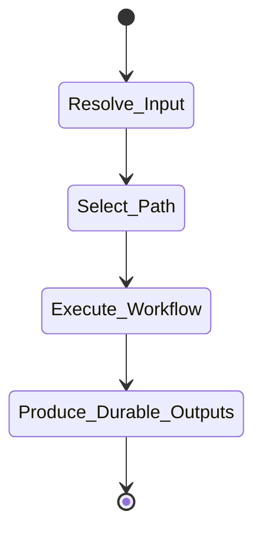

# Analyze Agent Skill

## Workflow

Use this reference to analyze a given agent skill from the skill files themselves and produce a Markdown report set under `<output-dir>`.

1. **Locate the skill folder**. Resolve the target folder from the user's request, then confirm it contains `SKILL.md`.
2. **Resolve `<output-dir>`** using **Output Contract**.
3. **Read the entrypoint completely**. Read `SKILL.md` from start to finish.
4. **Inspect runtime metadata**. Read `agents/openai.yaml` when present.
5. **Map linked resources**. Identify directly linked `references/`, `subskills/`, `scripts/`, `assets/`, mode pages, primitive pages, and workflow pages.
6. **Choose report units**. Always create an entrypoint report for `SKILL.md`. For multi-part skills, choose one report unit for each public subskill, subcommand, mode, workflow, or primitive page that has distinct workflow logic.
7. **Load workflow-critical resources** for each report unit. Read the linked pages needed to reconstruct execution flow and output artifacts. Do not load unrelated references just because they exist.
8. **Infer workflow logic**. Build a step model from frontmatter, invocation contract, workflow sections, subcommands, routing rules, guardrails, output contracts, and linked task pages.
9. **Infer durable outputs**. Extract explicit artifact paths, reports, manifests, generated files, modified files, branches, worktrees, messages, or other durable side effects. Label inferred outputs as inferred when no explicit path is stated.
10. **Fill the Markdown output template**. Use `references/md-output-template.md` for every report file.
11. **Write report files** using **Report Files** and **Output Formats**.
12. **Return a brief in-chat response** using `references/chat-response-template.md`.

If a skill has multiple subcommands or modes, write `ENTRYPOINT.md` for the top-level routing flow, then write one Markdown file for each analyzed subcommand or mode. If no specific subcommand is requested, analyze all public subcommands at a concise level.

## Output Contract

By default, `analyze` writes Markdown report files under `<output-dir>` and returns a brief in-chat response using `references/chat-response-template.md`.

Resolve `<output-dir>` in this order:

1. Use the output location explicitly provided by the user.
2. Otherwise, use `AGENT_SKILL_OUTPUT_DIR` when set; relative values are resolved from the current project directory and absolute values are used as-is.
3. Otherwise, use `<project-dir>/.agent-skill-handling/analysis/<target-skill-name>/`.

Write reports using these names:

- Primary `SKILL.md` entrypoint report: `<output-dir>/ENTRYPOINT.md`.
- Multi-part skill reports: `<output-dir>/<subskill-or-subcommand-name>.md` for each public subskill, subcommand, mode, workflow, or primitive page that deserves its own analysis.

Normalize non-entrypoint report file names to lowercase hyphen-case. `ENTRYPOINT.md` is the fixed uppercase filename for the primary `SKILL.md` report. Prefer the public subcommand or subskill name over the source file stem when they differ.

## Evidence Rules

- Treat `SKILL.md` as authoritative for trigger behavior and top-level workflow.
- Treat linked reference, subskill, workflow, mode, and primitive files as authoritative for their owned steps.
- Use `agents/openai.yaml` for UI metadata and implicit-invocation policy only.
- Distinguish explicit behavior from inferred behavior.
- Cite file paths and line numbers for important claims when practical.
- Report missing linked files, ambiguous routing, or absent output contracts as analysis gaps, not as assumed behavior.

## Report Files

Write these files under `<output-dir>`:

| Report Unit | File Name |
| --- | --- |
| Primary `SKILL.md` entrypoint | `ENTRYPOINT.md` |
| Public subskill | `<subskill-name>.md` |
| Public subcommand | `<subcommand-name>.md` |
| Public mode, workflow, or primitive page | `<public-name>.md` |

Normalize non-entrypoint report file names to lowercase hyphen-case. `ENTRYPOINT.md` is the fixed uppercase filename for the primary `SKILL.md` report. Prefer public names from the subcommand table, mode table, or invocation contract over source file stems. If two report units normalize to the same file name, add a short disambiguating suffix from the parent folder, such as `deploy-workflow.md` or `deploy-mode.md`.

For single-part skills, write only `ENTRYPOINT.md` unless the user requests deeper resource-level analysis.

The entrypoint report should summarize the whole skill and link to each per-part report with relative Markdown links. Each per-part report should focus on that part's workflow and artifacts, while noting its parent entrypoint.

## Output Formats

Use two templates:

- `references/chat-response-template.md` for the final chat response.
- `references/md-output-template.md` for each Markdown report file.

The chat response is brief and contains only `Workflow Overview`, `Step Explanation`, and `Durable Outputs`. Use an ASCII diagram in `Workflow Overview`.

The Markdown report files use the same core section names: `Workflow Overview`, `Step Explanation`, and `Durable Outputs`. They also include `Inner Workings` and `Key Constraints`. Use Mermaid diagrams in Markdown report files, but do not name the section `Mermaid UML Workflow`.

For `ENTRYPOINT.md`, add the Markdown template's `## Per-Part Reports` section when additional report files exist. Prefer exact paths and command names over broad descriptions.

## Workflow Diagrams

Use different diagram formats for chat and Markdown output:

- Chat response: ASCII boxes and arrows.
- Markdown report files: Mermaid state diagrams or flowcharts.

Use this ASCII style for chat:

```text
+---------------------+
| Start: invoked skill |
+---------------------+
          |
          v
+----------------------+
| Resolve target input |
+----------------------+
          |
          v
+----------------------+
| Select subcommand    |
+----------------------+
          |
          v
+----------------------+
| Execute workflow     |
+----------------------+
          |
          v
+----------------------+
| Produce artifacts    |
+----------------------+
          |
          v
+---------------------+
| End: final response |
+---------------------+
```

For branching, use compact decision boxes:

```text
+----------------------+
| Decision: subcommand? |
+----------------------+
      | help
      v
+--------------+
| Show help    |
+--------------+
      |
      | analyze
      v
+--------------+
| Analyze skill |
+--------------+
```

Use this Mermaid style for Markdown report files:



Do not overdraw every minor validation step. The diagram should make the control flow clear.

## Step Explanation

After the diagram, list each major step with a short introduction:

```md
1. **Resolve target skill**: Finds the skill folder and verifies `SKILL.md` exists.
2. **Read entrypoint**: Loads the top-level contract and workflow.
```

Use the analyzed skill's own terms when it defines subcommands, modes, phases, or artifacts.

## Durable Outputs

List artifacts the analyzed skill would create, modify, or emit during normal execution.

Use this table:

| Artifact | Path or Destination | Triggering Step | Evidence | Certainty |
| --- | --- | --- | --- | --- |
| Chat report | Chat session | Final response | `SKILL.md` output contract | Explicit |

Include non-file artifacts such as chat reports, mailbox messages, branches, worktrees, PRs, service units, downloaded source packs, or generated commands when the analyzed skill would produce them. If a skill only modifies existing files, list those as modified artifacts. If no generated artifacts are described, say so directly.

Do not confuse the analysis report files with the analyzed skill's durable outputs. The report files are this skill's output; this section describes what the analyzed skill would output when used.
