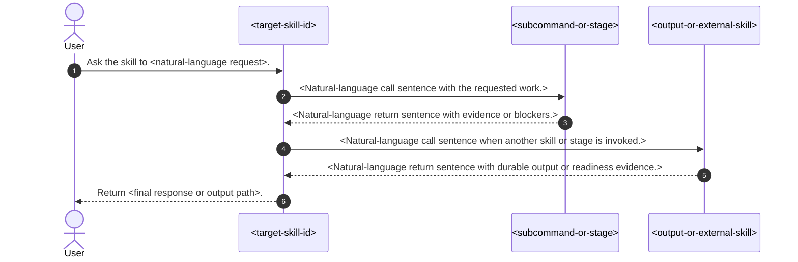
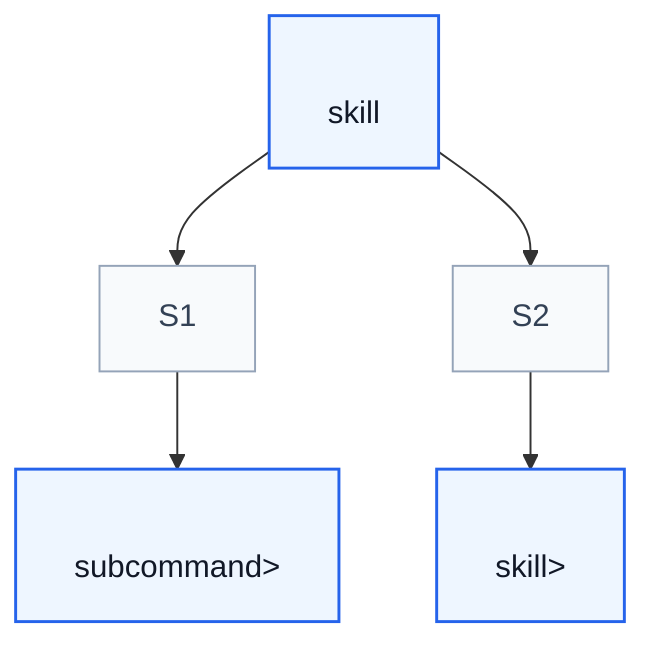

# Deep Inspect Agent Skill

## Workflow

Use this reference to generate one self-contained skill-process design document for a target skill. Use `analyze` instead when the user only wants to understand a skill's working logic through report files and a brief chat summary.

1. **Locate the skill folder**. Resolve the target folder from the user's request, then confirm it contains `SKILL.md`.
2. **Resolve the output file** using **Output Contract**.
3. **Read the target skill completely**. Read `SKILL.md`, `agents/openai.yaml` when present, and every directly linked reference page that defines public subcommands, modes, workflows, primitives, or routing behavior.
4. **Load local supporting references**. Read `references/skill-pseudo-lang.md` before drafting `## Formal Skill Process`, and read `references/mermaid-style.md` before drafting Mermaid diagrams.
5. **Map the process model**. Extract entrypoints, public subcommands, internal stages, external skill calls, input evidence, output evidence, durable side effects, blockers, and ownership boundaries.
6. **Choose the important concepts**. Select terms a reader must know to understand the process, then define them inside the generated document. Prefer terms from the target skill itself; do not require the reader to open another glossary.
7. **Draft the design document** using **Document Template**.
8. **Validate self-containment** using **Self-Containment Checklist**.
9. **Write the output file** and return a concise chat summary with the file path, important assumptions, and validation result.

If the user's task does not map cleanly to these steps, use your native planning tool to build a step-by-step plan from this reference, the target skill, and the user's requested output shape, then execute the plan.

## Output Contract

By default, `deep-inspect` writes one Markdown document. Resolve the output file in this order:

1. Use the file path explicitly provided by the user.
2. Otherwise, use `AGENT_SKILL_OUTPUT_DIR` when set, writing `<output-dir>/<target-skill-name>.md`.
3. Otherwise, when the current project has `context/design/skill-process/`, write `context/design/skill-process/<target-skill-name>.md`.
4. Otherwise, write `<project-dir>/.agent-skill-handling/deep-inspect/<target-skill-name>.md`.

Do not write a multi-file report set. Do not overwrite an unrelated design document unless the user explicitly names that path.

## Document Template

Use this template as the default scaffold. Replace placeholders with concrete content from the inspected skill, remove sections that truly do not apply, and keep the final document self-contained.

````markdown
# <Readable Skill Name> Skill Process

## Purpose

This note explains how `<target-skill-id>` operates as a skill process. It aligns `<target-skill-path>/SKILL.md`, its public subcommands or modes, and the directly linked workflow references that affect runtime behavior.

The key orchestration rule is: <one sentence describing who owns routing, evidence, blockers, and final output>.

## Concepts

- **<Concept Name>**: <One-sentence definition needed to understand this process.>
- **<Artifact or Evidence Name>**: <One-sentence definition, including path or owner when relevant.>
- **<External Actor or Skill>**: <One-sentence definition of its role in this process.>

## High Level Process



## Skill Call Graph

This graph shows top-level skill and public subcommand calls used by this process. Route nodes name the condition or public route that creates the edge.



| ID | Caller | Route | Callee | Calling condition |
| --- | --- | --- | --- | --- |
| S1 | `<caller>` | `<route>` | `<callee>` | <Natural-language condition that causes this call.> |
| S2 | `<caller>` | `<route>` | `<callee>` | <Natural-language condition that causes this call.> |

## Formal Skill Process

```python
@skill(
    name="<target-skill-id>",
    description="<plain description of the inspected skill process>",
)
def run_<target_skill_name>(user_request: str, target: Path | None = None) -> StageResult:
    # Entry point purpose: <why this skill owns the overall process>.
    # Example input: user_request="<example user request>"
    # Example output: StageResult(status="ready", evidence=["<final evidence>"])

    route = agent_select(
        ["<route-a>", "<route-b>", "<route-c>"],
        criterion="<how the skill chooses the narrowest route>",
        context={"user_request": user_request, "target": target},
    )

    first_stage = agent_do(
        "<Natural-language work owned by the target skill before delegation.>",
        context={"route": route, "target": target},
        returns=StageResult,
    )
    if first_stage.status in {"blocked", "failed"}:
        # Condition matched when <why the process must stop here>.
        return first_stage

    if route == "<route-a>":
        # Condition matched when <route-a applies>.
        return agent_do(
            "<Natural-language finalization for route-a.>",
            context={"first_stage": first_stage},
            returns=StageResult,
        )

    delegated = agent_invoke(
        "<callee-skill-or-subcommand>",
        task="<Natural-language task sent to the callee.>",
        context={"first_stage": first_stage},
        returns=StageResult,
        params={
            "expect": ["<expected evidence>", "<expected artifact>"],
            "must_not_call": ["<forbidden callee when relevant>"],
        },
    )
    if delegated.status in {"blocked", "failed"}:
        # Condition matched when <delegated stage reports blockers or failure>.
        return delegated

    return agent_do(
        "<Natural-language final validation or summary task.>",
        context={"first_stage": first_stage, "delegated": delegated},
        returns=StageResult,
    )
```

## Skill Process Explanation

The formal process is easier to read if each stage is understood as a handoff of responsibility, not just a sequence of calls. `<target-skill-id>` stays responsible for <routing/finalization/output ownership>.

- **<Stage name>.** <Explain what this stage receives, what it decides or produces, and why this boundary matters.>
- **<Stage name>.** <Explain the next handoff, including typical evidence and blockers.>
- **<Stage name>.** <Explain final validation, durable output, or user-facing response.>

## Evidence Handoffs

| Producing skill or stage | Evidence | Consuming stage |
| --- | --- | --- |
| `<producer>` | <Evidence or artifact that affects later routing or output.> | `<consumer>` |
| `<producer>` | <Evidence or artifact that affects later routing or output.> | `<consumer>` |
````

### Purpose

State what the inspected skill coordinates, which skill files or subcommands the design document aligns, and the one most important orchestration rule. Mention the target skill path.

### Concepts

Define the terms a reader must remember. Include skill-owned terms such as subcommands, modes, artifact names, evidence names, and external actors. Keep each definition to one sentence. Format important domain terms consistently; use code style only for literal file paths, skill ids, subcommands, environment variables, and commands.

### High Level Process

Use one Mermaid `sequenceDiagram` for the reader-facing process. Keep calls and returns as natural-language single sentences. Follow `references/mermaid-style.md` for diagram syntax and styling.

### Skill Call Graph

Use one Mermaid `flowchart TD` call graph. Include top-level skills and public subcommands that create meaningful call paths. Use route nodes when they explain why one skill or subcommand calls another. Follow `references/mermaid-style.md` for graph syntax and styling.

After the graph, include a table:

| ID | Caller | Route | Callee | Calling condition |
| --- | --- | --- | --- | --- |

Do not include files that are merely read for context as callgraph nodes. Include reference pages only when they are public subcommands, modes, workflow pages, or runtime routing targets.

### Formal Skill Process

Write Python-like pseudocode using the Agent-Primitive Python style in `references/skill-pseudo-lang.md` when it clarifies orchestration. Use ordinary Python for exact checks and `agent_*` calls for semantic work:

- `@skill(...)` for the target skill entrypoint.
- `agent_select(...)` for semantic route choice.
- `agent_do(...)` for local natural-language work.
- `agent_check(...)` for semantic gates.
- `agent_invoke(...)` for explicit calls to another skill or public subcommand.

Add comments only where they explain purpose, example input or output, or branch matching conditions. Put branch comments directly under the `if` or `else` statement and start them with `Condition matched when ...`.

### Skill Process Explanation

Explain the formal process as a skimmable Markdown list. Each bullet should help a reader understand a handoff of responsibility, not merely restate the pseudocode. Name the stage, what it receives, what it returns, and why the boundary matters.

### Evidence Handoffs

Use a table:

| Producing skill or stage | Evidence | Consuming stage |
| --- | --- | --- |

Include only evidence that affects later routing, validation, finalization, or durable output. If the inspected skill has no meaningful evidence handoffs, say so directly.

## Self-Containment Checklist

Before writing the output file, confirm:

- The document explains all important target-skill terms in `## Concepts`.
- A reader can understand the process without opening `SKILL.md` or generated analysis reports.
- The high-level process and formal process agree on stage order.
- The skill call graph includes only runtime routing relationships, not passive file reads.
- External calls, blockers, and durable outputs are labeled as explicit or inferred when needed.
- The output file is a single Markdown document.

## Chat Response

Return a brief response with:

- output file path,
- inspected skill path,
- sections generated,
- validation notes or unresolved assumptions.
