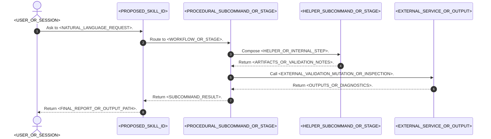
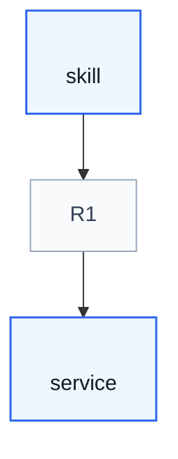

# <READABLE_SKILL_NAME> Design Overview

## Purpose

This note describes a proposed skill, `<PROPOSED_SKILL_ID>`, before it is created. It captures the intended user workflow, subcommands, process model, and user-facing contracts so a designer can review the skill's UX without reading generated skill files.

The key orchestration rule is: <ONE_SENTENCE_ROUTING_AND_OUTPUT_OWNERSHIP_RULE>.

## Concepts

This section defines the small vocabulary needed to read the skill workflow and examples. It favors user-facing terms that the skill should expose in plans, reports, and validation notes.

- **<CONCEPT_NAME>**: <ONE_SENTENCE_USER_FACING_DEFINITION>.
- **<CONCEPT_NAME>**: <ONE_SENTENCE_USER_FACING_DEFINITION>.

## Core Workflow

When this skill is invoked, execute the following steps in order.

1. **<STEP_NAME>.** <ONE_SENTENCE_ACTION>.
2. **<STEP_NAME>.** <ONE_SENTENCE_ACTION>.
3. **<STEP_NAME>.** <ONE_SENTENCE_ACTION>.

If the user's task does not map cleanly to these steps, <FREEFORM_FALLBACK_RULE>.

## Subcommands Design

This section lists the public workflows, nested command objects, subskills, and low-level primitives the skill can route to. Procedural subcommands represent user-facing tasks; helper subcommands represent reusable authoring or inspection steps. Direct and nested subcommands use resources owned by their containing skill or subskill. A capability that needs a private bundled-resource tree is a subskill.

### Subskills

<SUBSKILL_INTRO_OR_NO_SUBSKILLS_SENTENCE>

| Subskill | Invocation | Private Resources | Use For |
| --- | --- | --- | --- |
| `<SUBSKILL>` | `<PARENT_SKILL>-><SUBSKILL>` | `<SCRIPTS_REFERENCES_ASSETS_OR_OTHER_PRIVATE_RESOURCES>` | <PURPOSE> |

### Parent Command Contracts

<PARENT_COMMAND_INTRO_OR_NO_NESTED_COMMANDS_SENTENCE>

| Parent Command | Full Invocation | Terminal Behavior | Generated Child Context | Direct Children | Resource Owner |
| --- | --- | --- | --- | --- | --- |
| `<PARENT_COMMAND>` | `<SKILL_OR_SUBSKILL>-><PARENT_COMMAND>()` | <STANDALONE_TERMINAL_ACTION_HELP_OR_BLOCKER> | <CONTEXT_EXPOSED_TO_CHILDREN> | `<CHILD_COMMANDS>` | `<CONTAINING_SKILL_OR_SUBSKILL>` |

### Helper Subcommands

<HELPER_SUBCOMMAND_INTRO_OR_NO_HELPERS_SENTENCE>

| Subcommand | Invocation | Resource Owner | Use For | Load |
| --- | --- | --- | --- | --- |
| `<SUBCOMMAND>` | `<FULL_SUBCOMMAND_INVOCATION>` | `<CONTAINING_SKILL_OR_SUBSKILL>` | <PURPOSE> | `<DETAIL_PATH>` or this entrypoint |

### Procedural Subcommands

<PROCEDURAL_SUBCOMMAND_INTRO_OR_NO_PROCEDURAL_SUBCOMMANDS_SENTENCE>

| Subcommand | Invocation | Resource Owner | Use For | Load |
| --- | --- | --- | --- | --- |
| `<SUBCOMMAND>` | `<FULL_SUBCOMMAND_INVOCATION>` | `<CONTAINING_SKILL_OR_SUBSKILL>` | <PURPOSE> | `<DETAIL_PATH>` or this entrypoint |

### Misc Subcommands

<MISC_SUBCOMMAND_INTRO_OR_NO_MISC_SUBCOMMANDS_SENTENCE>

| Subcommand | Invocation | Resource Owner | Use For | Load |
| --- | --- | --- | --- | --- |
| `help` | `<PROPOSED_SKILL_ID>->help()` | `<PROPOSED_SKILL_ID>` | Explain this skill and list public subcommands. | This entrypoint |

## Core Workflow Diagram

This diagram shows the normal handoff from user request to subcommand routing, helper composition, external validation or mutation, and final reporting. It emphasizes which component coordinates the work and which external service remains authoritative.

## Calls To External Skills

This section identifies the project services or external skills the proposed skill depends on instead of reimplementing them. Include only true external dependencies, not internal helper subcommands.

| ID | Caller | Route | Callee | Calling condition |
| --- | --- | --- | --- | --- |
| R1 | `<CALLER>` | `<ROUTE>` | `<CALLEE>` | <NATURAL_LANGUAGE_CONDITION>. |

## Example Prompt And Expected AI Response

> **Warning:** The user/AI chat content below is for example purposes only. Implementations should learn its style, intent, and semantics rather than hardcoding the example content.

These examples show only the visible user prompt and the AI response content that should be returned to the user. Do not include hidden reasoning, chain-of-thought, scratchpad notes, private tool-selection deliberation, or thinking process in the AI response unless the user explicitly asks the skill to document that process.

### Event 001 - <SHORT_SCENARIO_TITLE>

> Time: `<EXAMPLE_TIME>` · Session: `<EXAMPLE_SESSION_OR_CONTEXT>`

User Prompt:

> <REALISTIC_USER_INVOCATION>

AI:

> <EXPECTED_VISIBLE_RESPONSE_SHAPE>

## Open Questions

- <ASSUMPTION_OR_UNRESOLVED_DECISION>.
