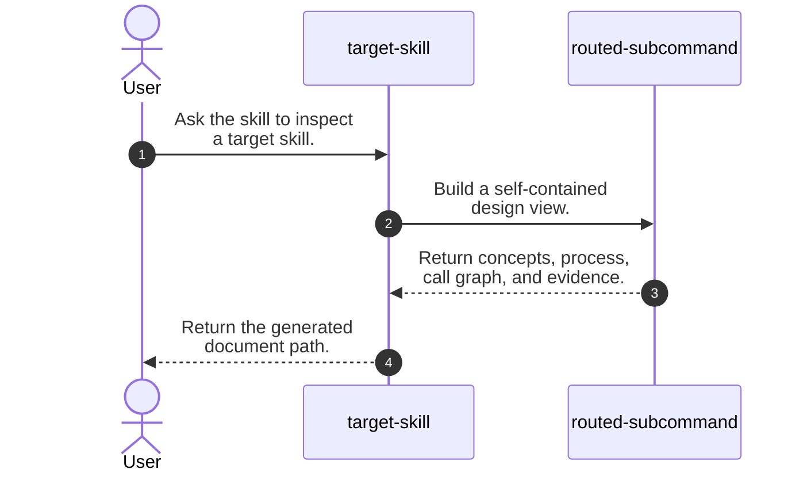
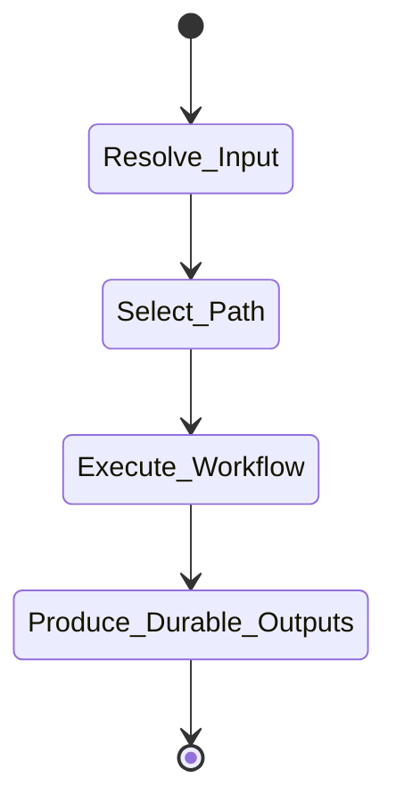
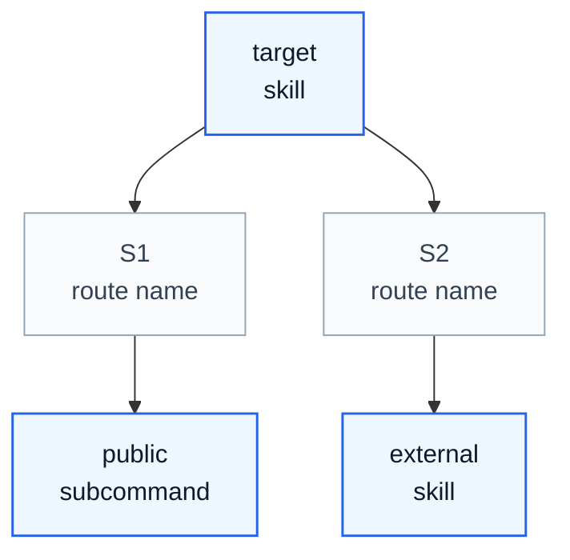

# Mermaid Style

Use this reference whenever an `imsight-agent-skill-handling` subcommand writes Mermaid diagrams in Markdown reports or design documents.

## Core Rules

- Use one fenced `mermaid` block per diagram.
- Prefer portable Mermaid syntax; do not add theme or init blocks unless the user requests them.
- Keep node IDs short and stable; put readable text inside quoted labels.
- Use ` ` for deliberate label wrapping.
- Quote labels when they contain punctuation, slashes, parentheses, or ` `.
- Keep each diagram focused on one purpose.

## Sequence Diagrams

Use `sequenceDiagram` for reader-facing process flow.

- Declare participants with short IDs and readable labels.
- Keep calls and returns as natural-language single sentences.
- Wrap long message labels with ` `.
- Avoid semicolons in message labels.
- Prefer broad handoffs over minor validation steps.

Example:

## Workflow Diagrams

Use `stateDiagram-v2` for lifecycle or control flow. Use `flowchart TD` when routing, handoffs, or caller-to-callee relationships matter more than state.

Do not overdraw every minor validation step. The diagram should make the major control flow clear.

Example:

## Skill Call Graphs

Use `flowchart TD` for skill call graphs.

- Use the primary analyzed skill or inspected skill as the root node.
- Represent public subcommands, modes, or external skills as skill nodes.
- Use route nodes when the route condition is important enough to name.
- Label edges with the trigger condition or explicit invocation form when that label helps the reader.
- Keep passive context files out of the graph unless they are runtime routing targets.
- Split the graph when it has more than roughly seven nodes in one row or more than two nested groups.

Use these classes when a subcommand needs styled callgraph nodes:

## Validation

- Check that every Mermaid fence opens and closes correctly.
- Check that sequence message labels do not contain semicolons.
- Check that flowchart labels with punctuation, slashes, parentheses, or ` ` are quoted.
- Check that the diagram matches the surrounding step table or explanation.
