# Format Mermaid

Reformat existing Mermaid diagrams in one or more Markdown documents so they match the portable, compact style used by the `mermaid-graphing` subskill. Preserve the surrounding prose and the semantic content of each diagram; change only layout, syntax, and presentation.

## Workflow

When this subskill is invoked, execute the following steps in order.

1. **Identify the target documents**. Use the file or directory the user named. If the user names a directory, collect all `*.md` files recursively. If no target is named, ask once unless the current project docs area is obvious.
2. **Read each document and locate every Mermaid fence**. Find every fenced block with the `mermaid` info string. Note the surrounding context so replacements keep the document structure intact.
3. **Classify each diagram**. Determine the diagram family from the first non-comment, non-blank line (`flowchart`, `sequenceDiagram`, `stateDiagram-v2`, `classDiagram`, `erDiagram`, `timeline`, `gantt`, or another Mermaid type).
4. **Reformat each diagram** using the rules in **Formatting Rules**. Keep the diagram's meaning, labels, participants, states, entities, and relationships unchanged unless a rendering problem forces a minimal, equivalent rewrite.
5. **Replace the original fences in place**. Do not reformat unrelated Markdown, code blocks, or prose. Preserve heading hierarchy, lists, tables, and line breaks outside the Mermaid fences.
6. **Validate when feasible**. Open reformatted diagrams in the target Markdown renderer or Mermaid Live Editor when syntax, theme support, or layout is uncertain.
7. **Return a concise handoff**. List the files touched, the number of diagrams reformatted, and any diagrams that needed a semantics-preserving rewrite to render correctly.

If the user's task does not map cleanly to these steps, use your native planning tool to build a step-by-step plan from the documents and constraints, then execute the plan.

## Formatting Rules

Apply the same style that `mermaid-graphing` uses for new diagrams.

### Markdown Embedding

Keep each diagram in its own fenced Markdown block with the exact `mermaid` info string:

````markdown
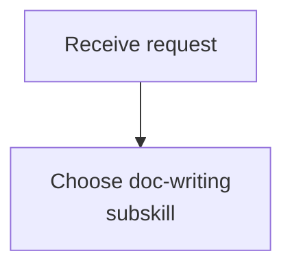
````

Do not mix Mermaid syntax with normal Markdown inside the same fence. Keep the diagram keyword exact for the chosen family; `sequenceDiagram` is case-sensitive in many renderers.

### Portable Styling

Prefer content and layout over theming. An optional init block is allowed when the target renderer supports it, but the diagram must still render if the init block is removed.

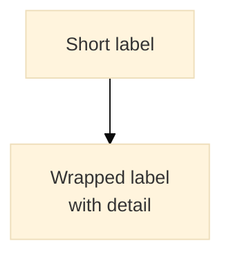

When compatibility matters, omit the init block and rely on short IDs, quoted labels, line breaks, and split diagrams.

### Layout Rules

- Keep IDs short and stable; put readable text in labels.
- Wrap labels with `<br/>`; do not use raw `\n` escapes for line breaks.
- Do not break class names, function names, command names, table names, or other identifiers across lines.
- Wrap around separators, arguments, or parenthetical context instead: `load_bundle<br/>(scene,camera,actors)` is acceptable; `load_bun<br/>dle` is not.
- Keep labels visually balanced: one to three short lines usually reads better than one long line or a stack of fragments.
- Split diagrams when a flow has more than roughly seven nodes in one row, more than two nested control blocks, or long repeated labels.
- Remove decorative detail that does not help the document's reader make a decision.

### Flowcharts

Use `flowchart TD` by default. Use `LR` only for short, linear pipelines or compact system boundary diagrams.

Quote node labels whenever a label contains `<br/>`, parentheses, colons, slashes, commas, quotes, or other punctuation:

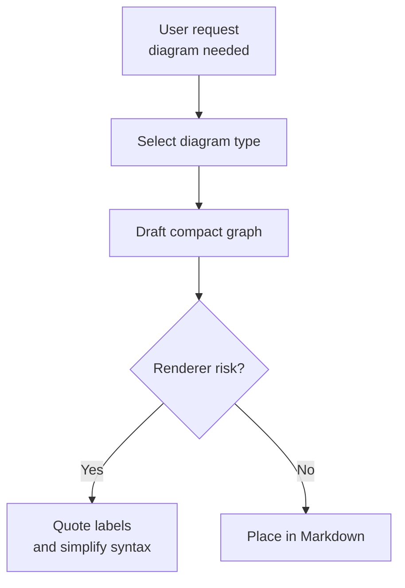

Use subgraphs for meaningful boundaries, not decoration. Keep subgraph titles short and avoid placing too many nodes inside one subgraph.

### Sequence Diagrams

Declare participants at the top with short IDs and readable labels. Wrap the label, not the ID.

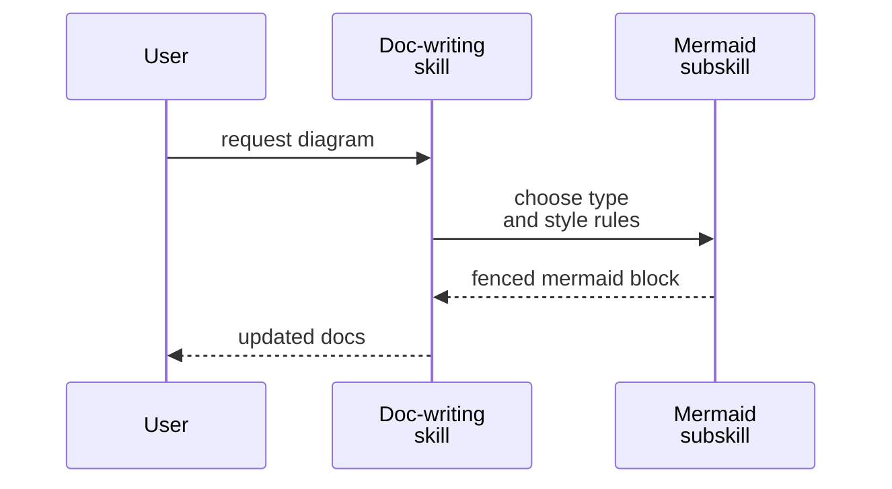

Keep arrow text concise, ideally under about 40 characters per visual line. When showing a call, command, or method, keep the identifier intact and wrap arguments or context:

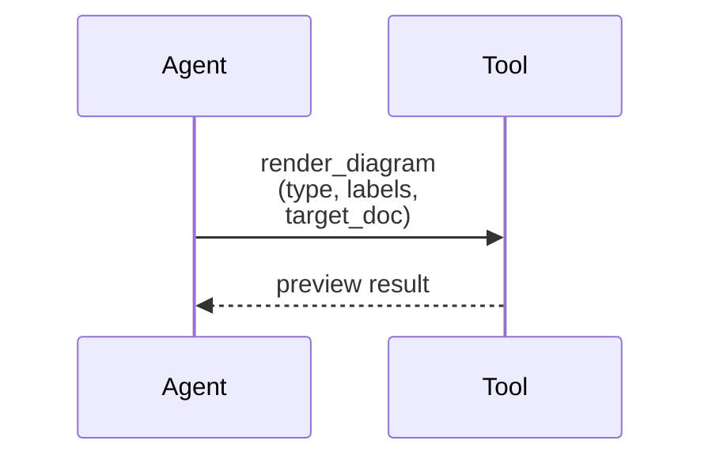

Use `alt`, `else`, `opt`, `loop`, and `par` for control flow, but keep block titles short. If a sequence needs more than two nested control blocks, split it into a high-level diagram and a focused detail diagram.

### State Diagrams

Keep state names noun-like and transitions verb-like.

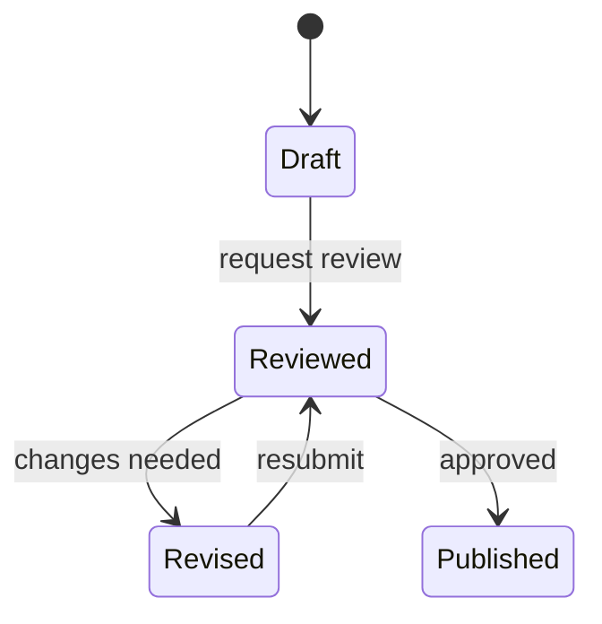

If a state label needs detail, use an alias and a quoted label:

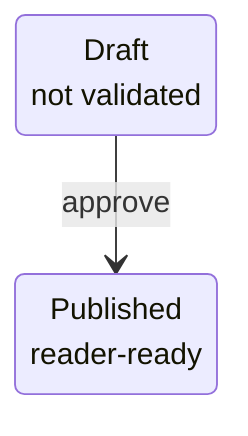

### Class And ER Diagrams

Use `classDiagram` for type relationships and `erDiagram` for data relationships. Show only the relationships relevant to the surrounding prose.

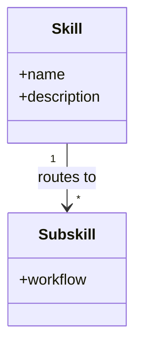

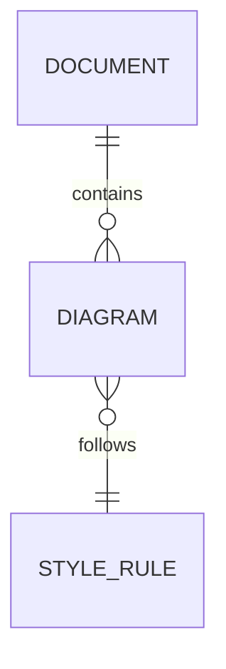

Avoid long method lists, full database schemas, and incidental fields. If the reader needs a complete schema, write a table and use the diagram only for relationships.

### Timeline And Gantt Diagrams

Use `timeline` for narrative chronology and `gantt` for actual schedules. Do not invent dates. If the user provides relative dates, convert them to explicit dates before writing a Gantt chart when the document depends on calendar accuracy.

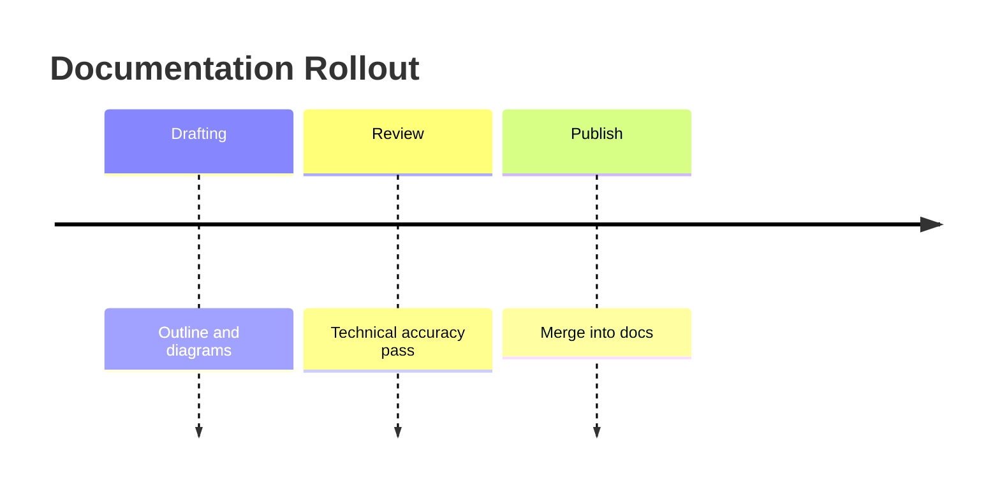

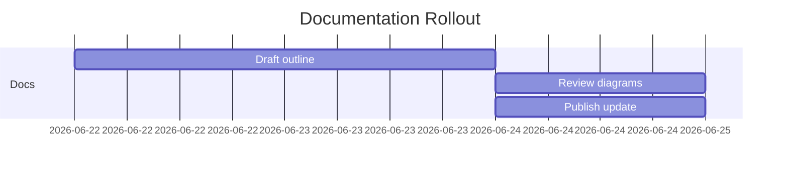

## Common Cleanup

- Remove trailing whitespace inside and around the Mermaid fence.
- Ensure every opening fence has a matching closing fence on its own line.
- Collapse multiple consecutive blank lines inside a diagram to a single blank line.
- Align indentation consistently with four spaces inside the fence when nesting improves readability.
- Drop renderer-specific CSS, unsupported directives, or duplicated init blocks unless the user explicitly asks to keep them.

## Troubleshooting Rules

- If a flowchart parse error points at `end`, inspect the node line above the subgraph boundary first.
- If a flowchart label uses `<br/>` or punctuation, quote the label as `ID["Label<br/>detail"]`.
- If a diagram becomes too wide, shorten IDs, wrap labels, and split the diagram before trying theme tweaks.
- If a sequence diagram fails, check the exact `sequenceDiagram` keyword, participant declarations, and control block endings.
- If a renderer ignores the init block, remove it and keep the portable syntax.
- If Mermaid Live Editor accepts a diagram but the target Markdown renderer fails, simplify syntax to the lowest-common-denominator form and avoid advanced theming.

## Shipping Checklist

- Every Mermaid diagram in the target documents is in its own fenced `mermaid` block.
- Each diagram has one clear purpose and is split if it tries to explain multiple concerns.
- Long labels use `<br/>`, not raw newline escapes.
- Identifiers remain intact across visual line breaks.
- Flowchart labels with special characters are quoted.
- Each diagram should fit without horizontal scrolling in the target Markdown page.
- Non-diagram content in each document is unchanged.
