# Mermaid Graphing

Create Mermaid diagrams that read well inside Markdown documents and survive common renderer differences. Optimize first for portable syntax, compact layout, and stable labels; use optional styling only after the diagram is structurally clean.

## Workflow

When this subskill is invoked, execute the following steps in order.

1. **Choose the diagram type**. Use the **Diagram Selection** table to map the user's documentation goal to a Mermaid diagram family.
2. **Draft the smallest useful diagram**. Include the main actors, states, entities, or steps needed for the reader's decision; split the diagram if one view becomes crowded.
3. **Apply the portable style rules**. See **Markdown Embedding**, **Layout Rules**, and the diagram-specific section for the selected type.
4. **Check renderer risks**. Use **Troubleshooting Rules** before shipping, especially when labels include HTML breaks, punctuation, or quoted strings.
5. **Place the diagram in context**. Add or edit only the surrounding prose needed to make the diagram's purpose clear.
6. **Validate when feasible**. Preview in the target Markdown renderer or Mermaid Live Editor when syntax, theme support, or layout is uncertain.

If the user's task does not map cleanly to these steps, use your native planning tool to build a step-by-step plan from the diagram types and style constraints below, then execute the plan.

## Diagram Selection

| Diagram Type | Use For | Preferred Direction |
| --- | --- | --- |
| `flowchart` | Workflows, decision trees, pipelines, architecture boxes, ownership boundaries | `TD` for layered flow; `LR` only when each column is short |
| `sequenceDiagram` | Calls, messages, request lifecycles, agent/tool interactions, handoffs over time | Native sequence layout |
| `stateDiagram-v2` | Lifecycle states, modes, transitions, allowed status changes | Native state layout |
| `classDiagram` | Type relationships, interfaces, implementation inheritance, conceptual object models | Native class layout |
| `erDiagram` | Data entities, table relationships, cardinality, schema sketches | Native ER layout |
| `timeline` | Historical milestones, release phases, project chronology | Native timeline layout |
| `gantt` | Date-bound schedules with dependencies | Native Gantt layout |

Prefer `flowchart` for explanatory architecture unless time ordering is the point. Prefer `sequenceDiagram` when the reader needs to see who does what in what order. Prefer splitting a crowded diagram into "overview" and "detail" diagrams over forcing every fact into one block.

## Markdown Embedding

Always use fenced Markdown with the `mermaid` info string and keep one Mermaid diagram per fence:

````markdown
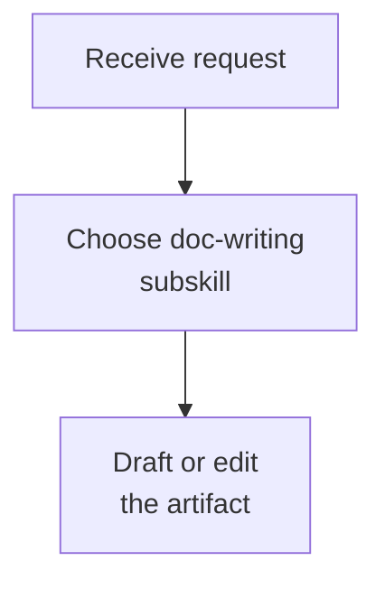
````

Do not mix Mermaid syntax with normal Markdown inside the same fence. Keep the Mermaid diagram keyword exact for the chosen diagram family; `sequenceDiagram` is case-sensitive in many renderers.

## Portable Styling

Use content and layout as the primary style. Optional Mermaid theme initialization can be used when the target renderer supports it, but the diagram must still work if the init block is removed.

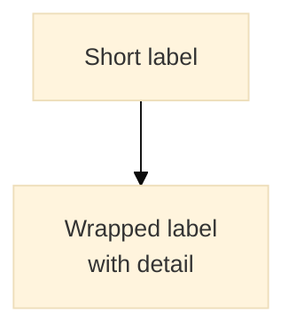

When compatibility matters, omit the init block and rely on short IDs, quoted labels, line breaks, and split diagrams. Avoid renderer-specific CSS tricks unless the target documentation system is known to support them.

## Layout Rules

- Keep IDs short and stable; put readable text in labels.
- Wrap labels with `<br/>`; do not use raw `\n` escapes for line breaks.
- Do not break class names, function names, command names, table names, or other identifiers across lines.
- Wrap around separators, arguments, or parenthetical context instead: `load_bundle<br/>(scene,camera,actors)` is acceptable; `load_bun<br/>dle` is not.
- Keep labels visually balanced: one to three short lines usually reads better than one long line or a stack of fragments.
- Split diagrams when a flow has more than roughly seven nodes in one row, more than two nested control blocks, or long repeated labels.
- Remove decorative detail that does not help the document's reader make a decision.

## Flowcharts

Use `flowchart TD` by default. Use `LR` only for short, linear pipelines or compact system boundary diagrams.

Quote node labels whenever a label contains `<br/>`, parentheses, colons, slashes, commas, quotes, or other punctuation:

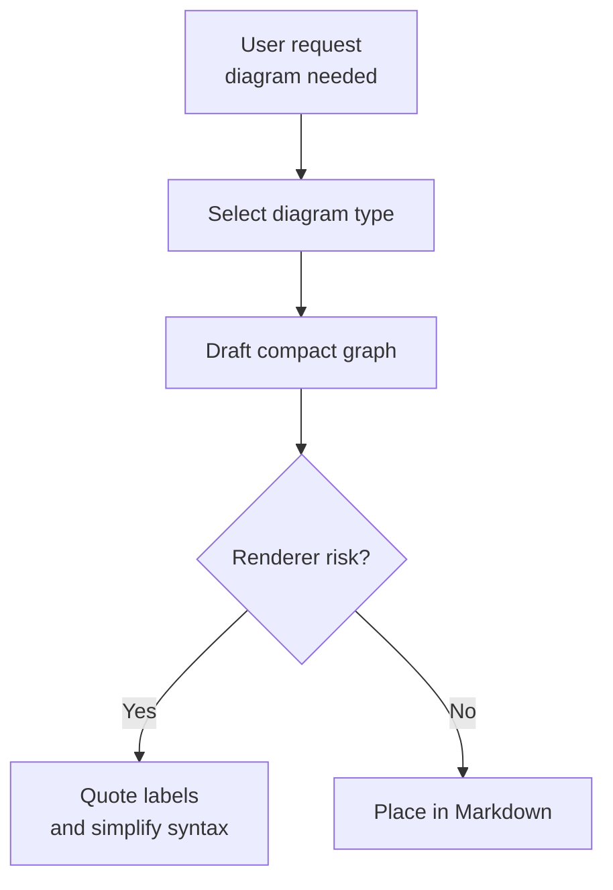

Use subgraphs for meaningful boundaries, not decoration. Keep subgraph titles short and avoid placing too many nodes inside one subgraph.

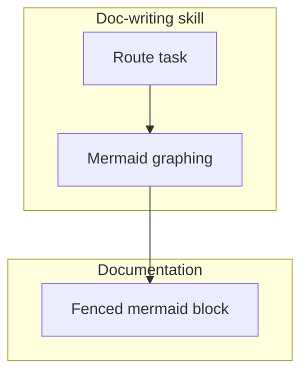

## Sequence Diagrams

Declare participants at the top with short IDs and readable labels. Wrap the label, not the ID.

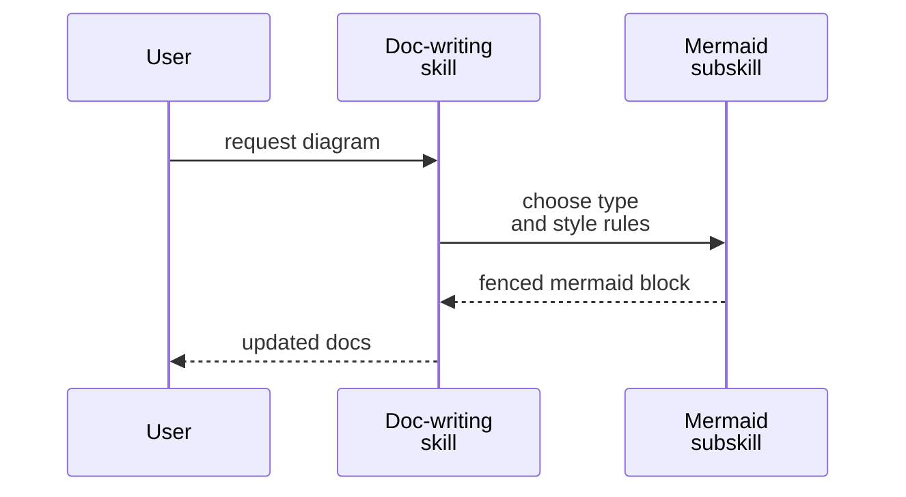

Keep arrow text concise, ideally under about 40 characters per visual line. When showing a call, command, or method, keep the identifier intact and wrap arguments or context:

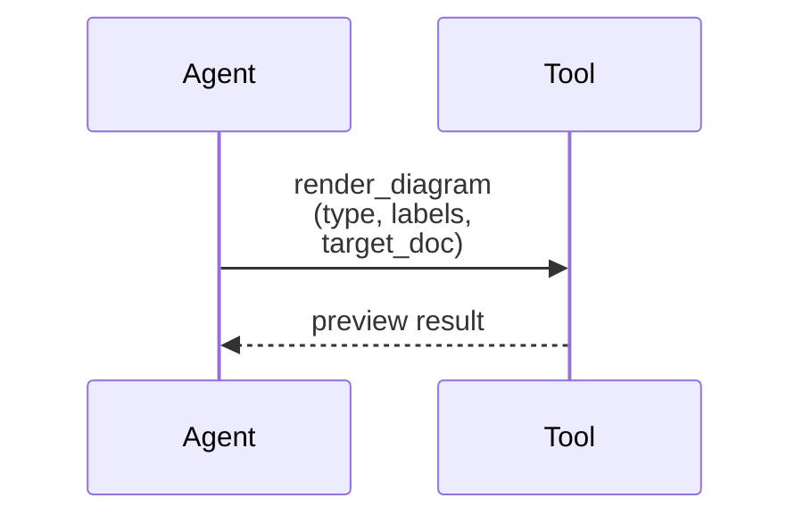

Use `alt`, `else`, `opt`, `loop`, and `par` for control flow, but keep block titles short. If a sequence needs more than two nested control blocks, split it into a high-level diagram and a focused detail diagram.

## State Diagrams

Use state diagrams when the doc explains allowed transitions. Keep state names noun-like and transitions verb-like.

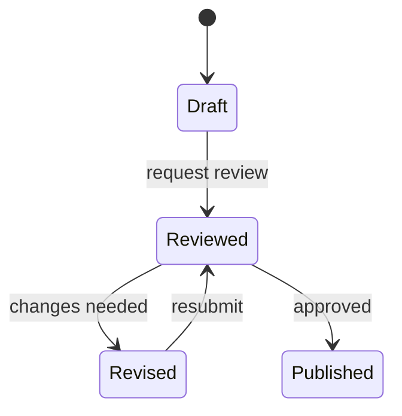

If a state label needs detail, use an alias and a quoted label:

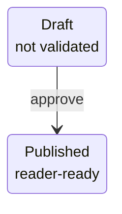

## Class And ER Diagrams

Use `classDiagram` for type relationships and `erDiagram` for data relationships. These diagram types get unreadable quickly, so show only the relationships relevant to the surrounding prose.

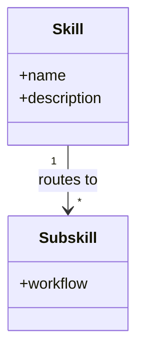

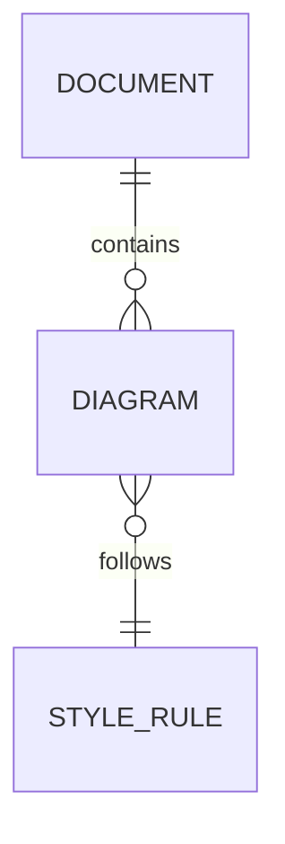

Avoid long method lists, full database schemas, and incidental fields. If the reader needs a complete schema, write a table and use the diagram only for relationships.

## Timeline And Gantt Diagrams

Use `timeline` for narrative chronology and `gantt` for actual schedules. Do not invent dates. If the user provides relative dates, convert them to explicit dates before writing a Gantt chart when the document depends on calendar accuracy.

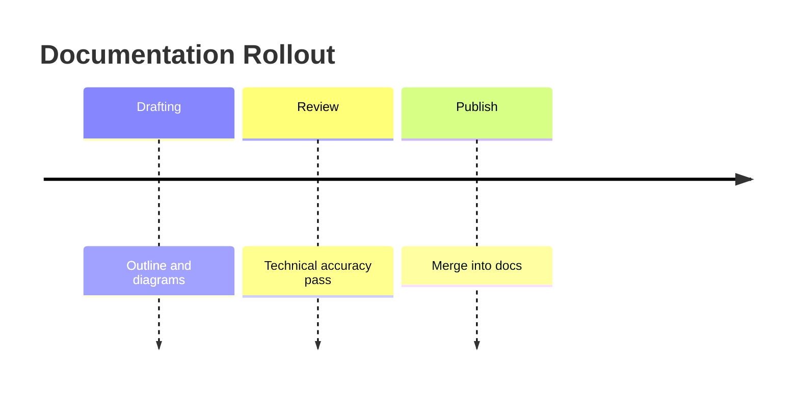

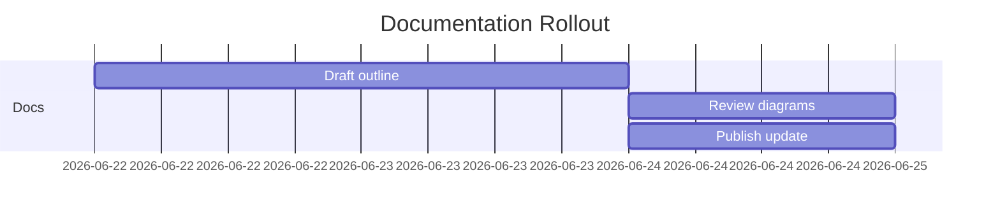

## Troubleshooting Rules

- If a flowchart parse error points at `end`, inspect the node line above the subgraph boundary first.
- If a flowchart label uses `<br/>` or punctuation, quote the label as `ID["Label<br/>detail"]`.
- If a diagram becomes too wide, shorten IDs, wrap labels, and split the diagram before trying theme tweaks.
- If a sequence diagram fails, check the exact `sequenceDiagram` keyword, participant declarations, and control block endings.
- If a renderer ignores the init block, remove it and keep the portable syntax.
- If Mermaid Live Editor accepts a diagram but the target Markdown renderer fails, simplify syntax to the lowest-common-denominator form and avoid advanced theming.

## Shipping Checklist

- The diagram is in a fenced `mermaid` block.
- The diagram has one clear purpose and is split if it tries to explain multiple concerns.
- Long labels use `<br/>`, not raw newline escapes.
- Identifiers remain intact across visual line breaks.
- Flowchart labels with special characters are quoted.
- The diagram should fit without horizontal scrolling in the target Markdown page.
