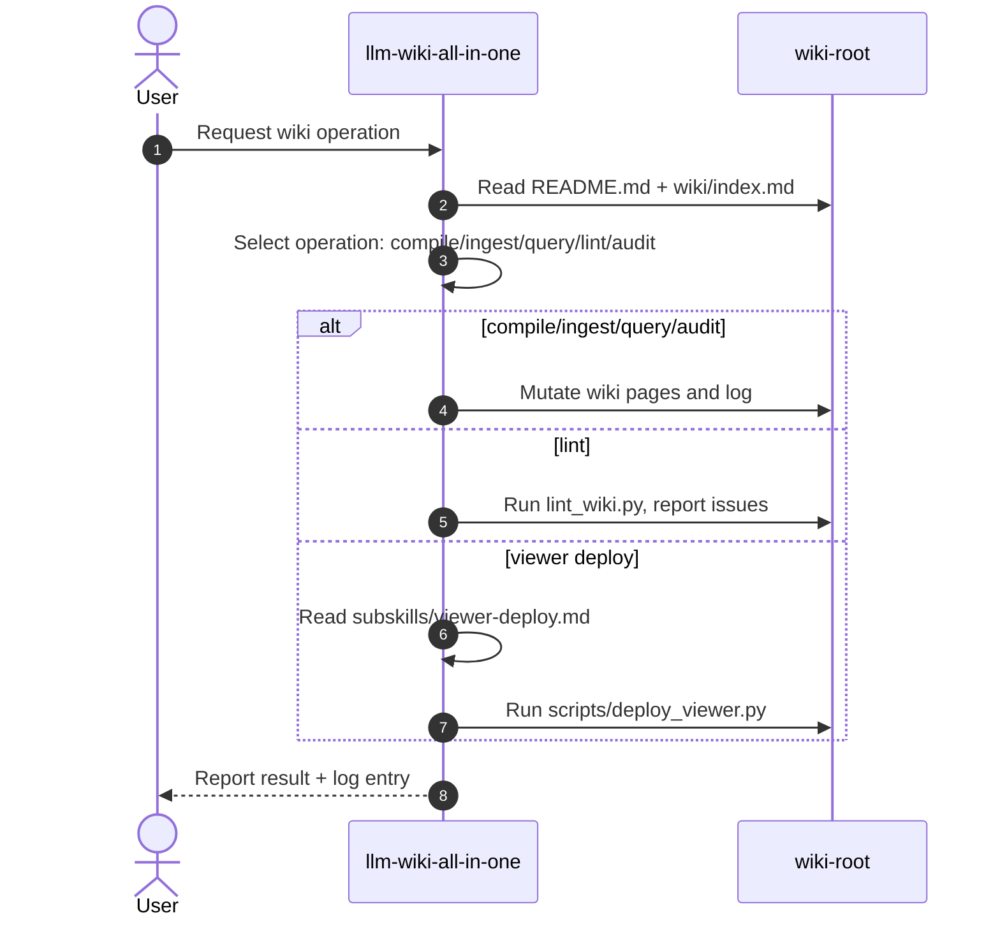
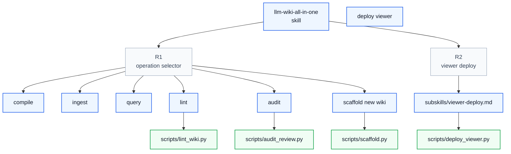

# Analysis of `llm-wiki-all-in-one`

Source skill: `extern/orphan/tool-skills/misc/llm-wiki-all-in-one`
Analysis written for migration to: `extern/orphan/houmao-agents/skillset/imsight-skills/imsight-llm-wiki`

## Purpose

The skill enables an agent to build and maintain a Karpathy-style LLM knowledge base. It treats the wiki as a compiled artifact: raw sources are ingested into structured wiki pages, queries are answered from the wiki, lint passes maintain link/index health, and an audit channel captures human feedback. The skill also bundles a local Node.js web viewer for browsing and filing feedback.

## Core Concepts

- **Wiki root** — directory containing `README.md`, `wiki/`, `raw/`, `audit/`, `log/`, `outputs/`.
- **Five operations** — `compile`, `ingest`, `query`, `lint`, `audit`.
- **README.md as schema** — scope, naming conventions, current articles, open questions, research gaps.
- **Vault-root wikilinks** — `[[wiki/concepts/foo|Foo]]`, `[[raw/refs/slug|...]]`, etc.
- **Divide-and-conquer** — keep concept pages 400–1200 words; split into folders when larger.
- **Audit feedback** — YAML-frontmatter files in `audit/` with text anchors; processed by the `audit` op.
- **Viewer** — local Node.js server under `viewer/` deployed by `scripts/deploy_viewer.py`.

## High-Level Process

## Skill Call Graph

## Formal Process

### Entrypoint contract

- `name: llm-wiki-all-in-one`
- `description`: starts with "Build and maintain..." and lists seven trigger scenarios.
- Trigger posture: broad; explicit "Use when" conditions.

### Operations

| Operation | Input | Output | Side effects |
|---|---|---|---|
| `compile` | Existing `raw/` and `wiki/` tree | Restructured wiki, rebuilt `index.md` | Writes wiki pages, updates `index.md`, appends log entry |
| `ingest` | New source (URL, PDF, note) | Summary page, concept/entity updates | Writes `raw/...`, `wiki/summaries/...`, `wiki/concepts/...`, `wiki/entities/...`, updates `index.md`, appends log entry |
| `query` | Question | Answer file in `outputs/queries/` | May promote durable answer to `wiki/concepts/`, appends log entry |
| `lint` | Wiki root | Issue report | Proposes fixes; applies after user confirmation; appends log entry |
| `audit` | Open `audit/*.md` files | Resolved audits in `audit/resolved/` | Edits target files, appends `# Resolution`, appends log entries |
| `viewer deploy` | Install dir, wiki root, port | Running viewer | Copies `viewer/`, installs deps, launches server |
| `scaffold` | Wiki root, topic title | Initial wiki tree | Creates directories, README.md, index.md, first log file |

### Quality gates / stop conditions

- Ask user before splitting/merging pages during `compile`.
- If the wiki lacks material for a query, say so and suggest ingestion instead of hallucinating.
- Do not silently ignore open audits.
- Lint must report issues and confirm fixes with the user.
- Viewer deploy must validate wiki root and port availability.

### Evidence handoffs

- Every operation appends an entry to `log/YYYYMMDD.md`.
- Audit files carry `anchor_before`/`anchor_text`/`anchor_after` for drift-tolerant target location.
- `wiki/index.md` is the authoritative catalog; `lint` enforces that every page appears exactly once.

## Artifacts and Storage

- `README.md` — schema; read at every session start.
- `wiki/index.md` — master catalog.
- `log/YYYYMMDD.md` — per-day operation log.
- `audit/*.md` — open human feedback.
- `audit/resolved/*.md` — processed feedback, never deleted.
- `raw/` — immutable source documents (articles, papers, notes, refs).
- `wiki/concepts/`, `wiki/entities/`, `wiki/summaries/` — generated knowledge.
- `outputs/queries/` — query answers.
- `viewer/` — bundled web viewer source.
- `scripts/` — Python helpers.

## Tool and Script Bindings

| Script | Purpose | Invocation |
|---|---|---|
| `scripts/scaffold.py` | Bootstrap new wiki | `python3 scripts/scaffold.py <wiki-root> "<Topic Title>"` |
| `scripts/lint_wiki.py` | Health check | `python3 scripts/lint_wiki.py <wiki-root>` |
| `scripts/audit_review.py` | List/group audits | `python3 scripts/audit_review.py <wiki-root> --open` |
| `scripts/deploy_viewer.py` | Deploy/launch viewer | `python3 scripts/deploy_viewer.py --install-dir <dir> --wiki <wiki-root> --port 8080` |

## External Dependencies

- Python 3 for scripts.
- Node.js/npm or bun for viewer build/run.
- Optional: Obsidian, Obsidian Web Clipper, qmd, Marp.

## Assumptions

- The agent can read and write Markdown files with YAML frontmatter.
- The agent can run Python scripts and Node.js commands.
- The user owns the wiki root and can install the viewer.
- Wikilinks follow the vault-root canonical form.

## Source File Inventory

Copied under `org/src/` with paths preserved:

- `SKILL-SOURCE.md` — source entrypoint preserved as provenance
- `subskills/viewer-deploy.md` — viewer deployment workflow
- `references/{schema-guide,article-guide,audit-guide,log-guide,tooling-tips,vault-root-link-resolver}.md`
- `scripts/{scaffold,lint_wiki,audit_review,deploy_viewer}.py`
- `viewer/audit-shared/` — TypeScript shared audit library
- `viewer/web/` — Node.js web viewer

## Notes for Migration

- The source is a single large entrypoint preserved as `SKILL-SOURCE.md` with inline operations. The Imsight target should split operations into subcommands with detail pages.
- The source's trigger description is long; Imsight style requires a concise "Use when..." description.
- Viewer deployment should become a subcommand (`deploy-viewer`) with `subskills/viewer-deploy.md` rewritten as `commands/deploy-viewer.md` or `references/viewer-deploy.md`.
- Reference pages are mostly style/instructional and map well to `references/` in the target.
- Scripts and `viewer/` assets are runtime support and should be copied into the target runtime tree.
- The all-in-one nature of the source should be preserved, but exposed as named subcommands.
