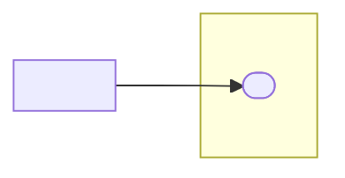

# Use Case <INDEX>: <USE_CASE_TITLE>

## Actor Goal

As a <ACTOR>, I want <GOAL>, so that <BENEFIT>.

## Use Case

<USE_CASE_PARAGRAPH>

## Supported Actions

### <ACTION_TITLE>

<ACTION_DESCRIPTION>

- context
  - Actor **has** <ACTOR_SIDE_PRECONDITION_OR_MATERIAL>.
  - System **has** <SYSTEM_SIDE_PRECONDITION_OR_CAPABILITY>.
- intent
  - Actor **wants** <DESIRED_OUTCOME>.
  - Actor **wonders** "<CONCRETE_QUESTION_IN_THE_ACTORS_MIND>".
- action
  - Actor then **asks** the system to <PERFORM_ACTION>.
- result
  - Actor **gets** <OBSERVABLE_OUTPUT_DECISION_ARTIFACT_STATUS_OR_NEXT_STEP>.

## Main Flow

1. <ACTOR_SYSTEM_STEP>
2. <ACTOR_SYSTEM_STEP>
3. <ACTOR_SYSTEM_STEP>

## Alternative And Exception Flows

- <ALTERNATIVE_OR_EXCEPTION_FLOW>

## Mermaid Flow Diagram



## Mermaid Sequence Diagram

```mermaid
sequenceDiagram
  autonumber
  actor Actor as <ACTOR>
  participant System as <SYSTEM_COMPONENT>

  Actor->>System: <REQUEST>
  System-->>Actor: <RESPONSE>
```

## Durable Outputs

- <ARTIFACT_RECORD_DECISION_STATE_CHANGE_OR_SIDE_EFFECT>

## Assumptions And Open Questions

- <ASSUMPTION_OR_OPEN_QUESTION>
