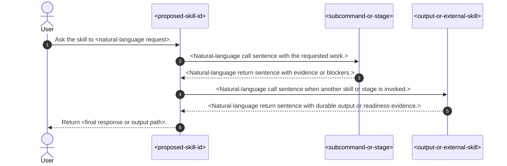
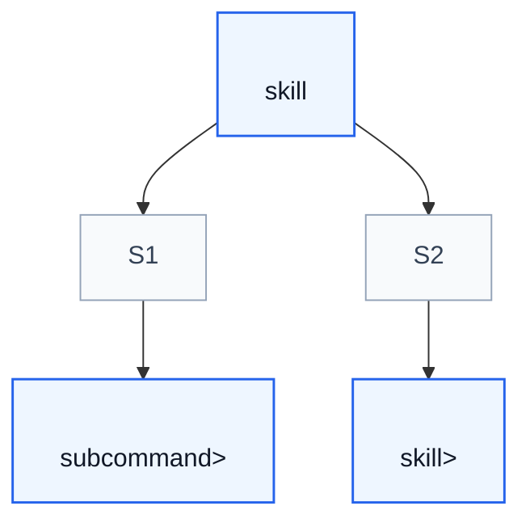

# Design Skill

## Workflow

When this subcommand is invoked, execute the following steps in order.

1. **Confirm the task and capture intent**. See **Intent Capture**.
2. **Classify the skill type** based on what it must do. See **Skill Type**.
3. **Choose the subcommand structure flavor**. See **Subcommand Structure**. Default to a multi-subcommand skill with a `help` subcommand unless the task clearly maps to a single technique or pattern.
4. **Propose a name and description** that conform to the Imsight skill format. See **Authoring the Proposed SKILL.md**.
5. **Resolve the output location** using **Output Contract**.
6. **Draft the design overview document** using **Design Document Template**.
7. **Validate the design document** using **Validation**.
8. **Write the output file** and return a concise chat summary with the file path, proposed skill name, and next recommended step.

If the user's task does not map cleanly to these steps, make reasonable assumptions, document them in `## Open Questions`, and flag them for the designer.

## Intent Capture

Start by understanding what the user wants the proposed skill to do. If the current conversation already contains a workflow the user wants to capture, extract answers from the conversation history first: the tools used, the sequence of steps, corrections the user made, and input/output formats observed.

If the user did not already provide the following, ask before drafting:

1. What should this skill enable the agent to do?
2. When should this skill be invoked? (user phrases or contexts)
3. What is the expected output format?

If the intent is unclear, make reasonable assumptions, document them in `## Open Questions`, and flag them for the designer.

## Skill Type

Choose the type that best matches the skill's purpose. The type influences how the design is tested and hardened later.

| Type | Description | Example |
| --- | --- | --- |
| Technique | Concrete method with steps to follow | condition-based-waiting |
| Pattern | Way of thinking about problems | flatten-with-flags |
| Reference | API docs, syntax guides, tool documentation | office docs |
| Discipline-enforcing | Rules that agents might rationalize away | TDD, verify-before-completion |

## Subcommand Structure

Default to a **multi-subcommand** skill that includes a `help` subcommand. This shape is general enough to handle procedural workflows, collections of routines, and mixed skills.

Use the **collection-of-routines** flavor when subcommands are peer routines, tools, or functions and their calling order is absent, flexible, or task-specific. Write one plain `## Subcommands` section with a table.

Use the **complex-procedure** flavor when the skill describes a multi-step procedure, each step may have its own sub-workflow or reference page, and some steps depend on artifacts produced by earlier steps. Split `## Subcommands` into:

- `### Procedural Subcommands` for user-facing workflow steps.
- `### Helper Subcommands` for lower-level implementation commands called by procedural subcommands.
- `### Misc Subcommands` for `help` and public shortcuts such as `fast-forward` or `step-by-step`.

For complex-procedure skills, put procedural subcommands in user-facing workflow order, keep helper subcommands out of help output unless promoted, and say `No helper subcommands are currently exposed.` when the helper group is empty.

Override the multi-subcommand default only when the task clearly maps to a single technique or pattern with no meaningful subcommands. Document the override reason in the design overview.

## Authoring the Proposed Skill

Define the proposed skill's frontmatter and core sections. Do not embed a full `SKILL.md` draft inside the design document; instead, capture the skill shape concisely and list subcommands in `## Subcommands Included`.

### Required Frontmatter

```yaml
---
name: <skill-name>
description: Use when <specific triggering conditions and symptoms>
---
```

Rules for the frontmatter:

- `name` must use letters, numbers, and hyphens only.
- `description` must start with "Use when..." and describe triggering conditions only. Do not summarize the workflow.
- Keep the description under 500 characters if possible, 1024 maximum.
- Write in third person.
- Include keywords agents would search for: error messages, symptoms, tools, library names.

### Core Sections to Define

1. **Overview** — core principle in 1-2 sentences.
2. **When to Use** — symptoms and contexts that trigger this skill. Include when NOT to use.
3. **Workflow** or **Core Pattern** — the technique, pattern, or rule the agent must follow.
4. **Subcommands Included** — list of subcommands derived from **Subcommand Structure**.
5. **Common Mistakes** — what goes wrong and how to fix it.

When the proposed skill has subcommands, apply **Subcommand Structure** before writing `## Subcommands Included`.

For discipline-enforcing skills, also include:

- A foundational principle such as "Violating the letter of the rules is violating the spirit of the rules."
- A rationalization table.
- A red flags list.

## Output Contract

By default, this subcommand writes one Markdown document named `design-overview.md` inside the already-resolved project-design feature directory. The feature directory is resolved by the entry workflow before this subcommand runs; do not re-resolve it.

Write the design overview to `<feature-dir>/design/<slug>/design-overview.md`, where `<slug>` is derived from the proposed skill name and contains no more than six words.

Derive `<slug>` from the proposed skill `name` by taking up to the first six meaningful words, lowercasing, and joining with hyphens. If the skill name is shorter than six words, use the full name.

Do not write any other skill files. Do not create `SKILL.md`, `agents/openai.yaml`, `references/`, `commands/`, `scripts/`, or `assets/` directories for the proposed skill.

## Design Document Template

Use this template as the default scaffold for `design-overview.md`. Replace placeholders with concrete content from the proposed skill design, remove sections that do not apply, and keep the document self-contained.

````markdown
# <Readable Skill Name> Design Overview

## Purpose

This note describes a proposed skill, `<proposed-skill-id>`, before it is created. It captures the intended triggering conditions, workflow, subcommands, process model, and file layout so a designer can review the shape of the skill without reading generated skill files.

The key orchestration rule is: <one sentence describing who owns routing, evidence, blockers, and final output>.

## Proposed File Inventory

| Relative Path | Category | Purpose |
| --- | --- | --- |
| `<skill-name>/SKILL.md` | Entrypoint | <One-sentence explanation of the skill entrypoint.> |
| `<skill-name>/agents/openai.yaml` | Agent config | <One-sentence explanation of the agent configuration, if needed.> |
| `<skill-name>/references/<file>.md` | Reference | <One-sentence explanation of the reference file.> |

## Concepts

- **<Concept Name>**: <One-sentence definition needed to understand this process.>
- **<Artifact or Evidence Name>**: <One-sentence definition, including path or owner when relevant.>
- **<External Actor or Skill>**: <One-sentence definition of its role in this process.>

## Subcommands Included

List every subcommand the proposed skill exposes. Use the structure chosen in **Subcommand Structure**.

For a **collection-of-routines** flavor, write one table:

| Subcommand | Use For | Load / Detail |
| --- | --- | --- |
| `help` | Explain this skill and list available subcommands | This entrypoint |
| `<subcommand>` | <purpose> | `<references/file.md>` or inline workflow |

For a **complex-procedure** flavor, split into subsections:

### Procedural Subcommands

| Subcommand | Use For | Load / Detail |
| --- | --- | --- |
| `<subcommand>` | <purpose> | `<references/file.md>` or inline workflow |

### Helper Subcommands

| Subcommand | Use For | Load / Detail |
| --- | --- | --- |
| `<subcommand>` | <purpose> | `<references/file.md>` or inline workflow |

If no helper subcommands are exposed, write `No helper subcommands are currently exposed.` instead of a table.

### Misc Subcommands

| Subcommand | Use For | Load / Detail |
| --- | --- | --- |
| `help` | Explain this skill and list available subcommands | This entrypoint |
| `<shortcut>` | <purpose> | Inline or delegated to a procedural subcommand |

## High Level Process



## Skill Call Graph



| ID | Caller | Route | Callee | Calling condition |
| --- | --- | --- | --- | --- |
| S1 | `<caller>` | `<route>` | `<callee>` | <Natural-language condition that causes this call.> |
| S2 | `<caller>` | `<route>` | `<callee>` | <Natural-language condition that causes this call.> |

## Formal Skill Process

```python
@skill(
    name="<proposed-skill-id>",
    description="<plain description of the proposed skill process>",
)
def run_<skill_name>(user_request: str, target: Path | None = None) -> StageResult:
    # Entry point purpose: <why this skill owns the overall process>.
    # Example input: user_request="<example user request>"
    # Example output: StageResult(status="ready", evidence=["<final evidence>"])

    route = agent_select(
        ["<route-a>", "<route-b>", "<route-c>"],
        criterion="<how the skill chooses the narrowest route>",
        context={"user_request": user_request, "target": target},
    )

    first_stage = agent_do(
        "<Natural-language work owned by the skill before delegation.>",
        context={"route": route, "target": target},
        returns=StageResult,
    )
    if first_stage.status in {"blocked", "failed"}:
        # Condition matched when <why the process must stop here>.
        return first_stage

    if route == "<route-a>":
        # Condition matched when <route-a applies>.
        return agent_do(
            "<Natural-language finalization for route-a.>",
            context={"first_stage": first_stage},
            returns=StageResult,
        )

    delegated = agent_invoke(
        "<callee-skill-or-subcommand>",
        task="<Natural-language task sent to the callee.>",
        context={"first_stage": first_stage},
        returns=StageResult,
        params={
            "expect": ["<expected evidence>", "<expected artifact>"],
            "must_not_call": ["<forbidden callee when relevant>"],
        },
    )
    if delegated.status in {"blocked", "failed"}:
        # Condition matched when <delegated stage reports blockers or failure>.
        return delegated

    return agent_do(
        "<Natural-language final validation or summary task.>",
        context={"first_stage": first_stage, "delegated": delegated},
        returns=StageResult,
    )
```

## Skill Process Explanation

The formal process is easier to read if each stage is understood as a handoff of responsibility, not just a sequence of calls. `<proposed-skill-id>` stays responsible for <routing/finalization/output ownership>.

- **<Stage name>.** <Explain what this stage receives, what it decides or produces, and why this boundary matters.>
- **<Stage name>.** <Explain the next handoff, including typical evidence and blockers.>
- **<Stage name>.** <Explain final validation, durable output, or user-facing response.>

## Evidence Handoffs

| Producing skill or stage | Evidence | Consuming stage |
| --- | --- | --- |
| `<producer>` | <Evidence or artifact that affects later routing or output.> | `<consumer>` |
| `<producer>` | <Evidence or artifact that affects later routing or output.> | `<consumer>` |

## Example Prompt And Expected AI Response

> **Warning:** The user/AI chat content below is for example purposes only. Implementations should learn its style, intent, and semantics rather than hardcoding the example content.

These examples show only the visible user prompt and the AI response content that should be returned to the user. Do not include hidden reasoning, chain-of-thought, scratchpad notes, private tool-selection deliberation, or thinking process in the AI response unless the user explicitly asks the skill to document that process.

### Event 001 - <Short Scenario Title>

> Time: `<example-or-placeholder-time>` · Session: `<example-session-or-context>`

User Prompt:

> <realistic user invocation>

AI:

> <expected response shape or illustrative response>

## Open Questions

- <Assumption or unresolved decision that the designer must confirm before implementation.>
- <Assumption or unresolved decision that the designer must confirm before implementation.>
````

## Validation

Validate the design document before writing the output file:

1. Confirm the proposed skill frontmatter has valid YAML with `name` and `description`.
2. Confirm `name` uses letters, numbers, and hyphens only.
3. Confirm the description starts with "Use when...", is in third person, and does not summarize the workflow.
4. Confirm the design document includes overview, when-to-use, workflow/core-pattern, and subcommands-included sections.
5. Confirm the workflow is a concise numbered list with a freeform fallback.
6. Confirm long procedural detail has been moved out of the workflow into dedicated sections or reference pages.
7. If subcommands exist, confirm the selected subcommand structure flavor matches the proposed skill functionality and the subcommands are listed in the correct table(s).
8. Confirm the output location is inside the already-resolved project-design feature directory.
9. Confirm the design document does not propose writing actual skill files.
10. If the design includes user/AI chat examples, confirm they include the example-content warning.

Report any validation failures and fix them before writing the output file.

## Chat Response

Return a brief response with:

- output file path,
- proposed skill name,
- subcommand structure flavor chosen,
- validation notes or unresolved assumptions,
- next recommended step (usually continue with `design-interface` for non-skill contracts or move to `design-agent-task`).
