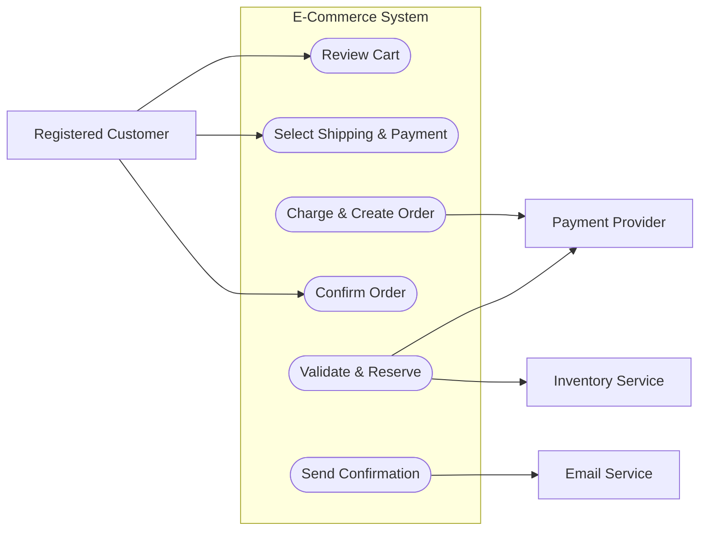
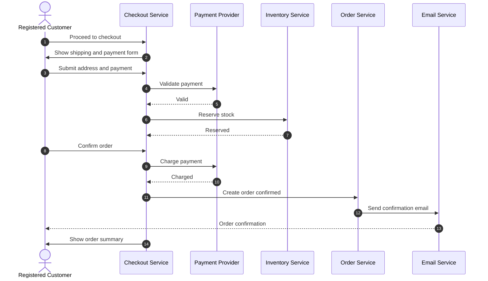

# Use Case Design

Use `usecase-design` when the user wants to produce or improve scenario-driven use cases. It supports two modes: `create` drafts use cases from scratch, and `clarify-and-refine` inspects existing use cases against project context and asks targeted questions before updating them.

## Modes

| Mode | Use For | Detail |
| --- | --- | --- |
| `create` | Draft use cases from scratch using the project goal, user instruction, referenced files, and repository evidence | [Create Mode](#create-mode) |
| `clarify-and-refine` | Review existing use cases against project context, system design, and domain language, ask clarifying questions, and refine them | [Clarify and Refine Mode](#clarify-and-refine-mode) |

## Workflow

When `usecase-design` is selected, execute the following steps in order. Detailed rules for each step are in the sections referenced below.

1. **Determine the project directory**. See **Project Directory** in the parent skill.
2. **Resolve `<output-dir>`**. Use the parent skill's **Output Directory Discovery** rules. Use cases are written under `<output-dir>/use-cases/`.
3. **Load prior exploration artifacts**. Check `<output-dir>/` for existing `domain-concepts/`, `adrs/`, `design-choice/`, `designs/`, and `use-cases/` files. Incorporate them into the evidence set and do not contradict them without flagging the conflict.
4. **Prepare the domain language baseline**. Follow the parent skill's **First Step: Prepare Domain Language**. Treat confirmed terms as the vocabulary for actor, entity, and action names in the use cases.
5. **Select a mode**. See **Mode Selection**.
6. **Execute the selected mode's workflow**. See [Create Mode](#create-mode) or [Clarify and Refine Mode](#clarify-and-refine-mode).
7. **Run a Spec Self-Review**. See **Spec Self-Review**.
8. **Produce a Completion Report**. See **Completion Report**.

If the user's task does not map cleanly to these steps, use your native planning tool to build a step-by-step plan based on the constraints above and the user's specific goal, then execute the plan.

## Mode Selection

Select **`create`** when:

- The user asks to create, draft, or write use cases.
- There are no existing use cases under `<output-dir>/use-cases/` and the user wants new ones.
- The prompt provides enough context (project goal, actors, and scenario) to draft a reasonable first version.

Select **`clarify-and-refine`** when:

- The user asks to review, refine, clarify, or improve existing use cases.
- Existing use cases are present under `<output-dir>/use-cases/` or are explicitly referenced.
- The user mentions ambiguities, conflicts, missing scenarios, or inconsistencies with the domain language or system design.
- The task is to align use cases with architecture notes, ADRs, or a design document.

If the mode is unclear, prefer `create` when no use cases exist and prefer `clarify-and-refine` when use cases already exist.

## Hard Gate

Do not start implementation — write code, scaffold a project, or invoke an implementation skill — until the user explicitly asks to switch from exploration to implementation.

- In `create` mode, write the use-case artifacts automatically after drafting; producing the artifacts is the expected output of the mode.
- In `clarify-and-refine` mode, present revised drafts and wait for user approval or change requests before writing the final artifacts, unless the user explicitly requested a non-interactive audit or asked the agent to make reasonable assumptions.

## Context Gathering

Before drafting or refining use cases, collect and synthesize the following sources:

- **Project goal**: the high-level outcome the project is meant to enable.
- **User instruction**: the current prompt and any explicit requests about scope, actors, or behavior.
- **Nearby prompts and discussions**: prior messages in the session that establish intent, constraints, or decisions.
- **Referenced files**: files the user pointed to, plus related docs, specs, issues, or PRDs.
- **Repository evidence**: `AGENTS.md`, `README.md`, `docs/`, `specs/`, `CONTEXT.md`, architecture notes, ADRs, behavior surfaces, tests, and existing `use-cases/` files.
- **Domain language**: canonical terms from `domain-concepts/` or the dominant vocabulary in code.

Cite file paths and line numbers when reporting evidence. If the same concept has multiple names across sources, flag the conflict and propose a canonical term before writing or updating the use case.

## Create Mode

Use `create` to produce an initial set of use cases without asking the user clarifying questions. Make reasonable assumptions from the project context and document them inline.

### Create Mode Workflow

1. **Gather project context**. See **Context Gathering**.
2. **Run an internal Use-Case Coverage Scan**. See **Use-Case Coverage Scan**. Do not show the raw map to the user and do not ask questions.
3. **Draft 1–5 use cases** using the format in **Drafting Use Cases**. Use the established domain language.
4. **Run an internal consistency check** against prior artifacts. Flag any conflicts as assumptions or open questions in the drafts.
5. **Write the use-case artifacts** to `<output-dir>/use-cases/`. See **Writing Use-Case Artifacts**.
6. **Run a Spec Self-Review**.
7. **Produce a Completion Report**.

If critical information is missing, state the assumption or open question inside the use-case artifact rather than blocking or asking the user.

## Clarify and Refine Mode

Use `clarify-and-refine` to improve existing use cases by inspecting project context and asking the user targeted questions.

### Clarify and Refine Mode Workflow

1. **Load existing use cases** from `<output-dir>/use-cases/` or from paths the user referenced.
2. **Inspect project context**. See **Context Gathering**. Pay special attention to system design, domain language, and behavior surfaces that may conflict with or extend the existing use cases.
3. **Run a Coverage & Clarity Scan**. See **Coverage & Clarity Scan**.
4. **Enter the adaptive questioning loop**. Prepare to ask up to 5 clarification questions, generating each one from the current coverage map. See **Question Constraints**.
5. **Execute the Sequential Questioning Loop**. Present exactly one question at a time. See **Sequential Questioning Loop**.
6. **After each answer, integrate**. Update the coverage map, note decisions, and revise the affected use cases. See **Integration After Each Answer**.
7. **Present revised drafts for review**. Show the user the updated user stories, scenarios, and flow summaries. Ask for edits, additions, or approval.
8. **Write the use-case artifacts**. See **Writing Use-Case Artifacts**.
9. **Run a Spec Self-Review**.
10. **Produce a Completion Report**.

If the user's task does not map cleanly to these steps, use your native planning tool to build a step-by-step plan based on the constraints above and the user's specific goal, then execute the plan.

### Coverage & Clarity Scan

Perform a structured scan across this taxonomy. For each category, mark status: **Clear** / **Partial** / **Missing**. Produce an internal coverage map (do not output the raw map unless no questions will be asked).

| Category | What to Check |
| --- | --- |
| **Actor clarity** | Are all actors named? Are their roles and goals clear? |
| **Goals & success criteria** | Is the user story concrete and the success criterion observable? |
| **Trigger & preconditions** | What starts the use case and what must already be true? |
| **Main success scenario** | Is the happy path complete and ordered logically? |
| **Alternative & exception flows** | Are significant branches, errors, cancellations, or retries documented? |
| **Durable outputs & postconditions** | Are artifacts, records, and state changes explicit? |
| **Domain language alignment** | Do actor, entity, and action names match the established domain language? |
| **Consistency with system design** | Do the use cases fit the architecture, components, and interfaces in the design? |
| **Gaps vs. behavior surfaces** | Are routes, API endpoints, CLI commands, or UI pages missing from the use cases? |
| **Cross-use-case relationships** | Do multiple use cases overlap, contradict, or leave coverage gaps? |
| **Open questions / gaps** | Is there missing information that affects scope or acceptance criteria? |

For each category with **Partial** or **Missing** status, add a candidate question opportunity unless clarification would not materially change the use cases or is better deferred to planning.

### Question Constraints

- Ask at least 1 question before finalizing revised use cases, writing artifacts, or producing a final proposed direction, unless the user explicitly requested a non-interactive audit, explicitly asked the agent to make reasonable assumptions, or provided all required decisions in the prompt.
- **Maximum 5 total questions** across the whole session. Generate each question one at a time; do not build a fixed queue of 5 questions in advance.
- Each question must be answerable with **either**:
  - A short multiple-choice selection (2–5 distinct, mutually exclusive options), **or**
  - A short-phrase answer. The agent's proposed answer should be concise, but the user may provide a custom answer of any length.
- Only include questions whose answers materially impact actor boundaries, scenario scope, success criteria, durable outputs, terminology, or acceptance criteria.
- Ensure category coverage balance: attempt to cover the highest-impact unresolved categories first.
- Exclude questions already answered by repo evidence, trivial stylistic preferences, or plan-level execution details (unless blocking correctness).
- Do not reveal future questions in advance. Because each question is generated after the previous answer is integrated, there is no fixed queue to reveal.

### Sequential Questioning Loop

Present **exactly one question at a time**.

Follow the same multiple-choice and short-answer formats defined in `modes/design-choice.md`:

- State the **motivation** and a concrete **example**.
- Provide a **proposed option/answer** with **why it is proposed** and **downstream implications**.
- Render multiple-choice options in a Markdown table with a **Pros/Cons** column and a **Short** row for custom answers.
- After the user answers, validate it, record it, update the coverage map, and decide whether another question is needed. If another question is needed and fewer than 5 have been asked, generate the next single question from the updated coverage map.

**Stop asking** when:

- No further material ambiguity remains that is worth asking about, **or**
- The user signals completion ("done", "good", "no more", "stop", "proceed"), **or**
- You reach 5 asked questions.

## Use-Case Coverage Scan

Use this scan in `create` mode and as part of the **Coverage & Clarity Scan** in `clarify-and-refine` mode.

| Category | What to Check |
| --- | --- |
| **Primary Actors** | Human roles, external systems, or agent roles that initiate or participate in the scenario. |
| **Goals & Success Criteria** | What each actor wants and how to know the use case succeeded. |
| **Trigger & Preconditions** | What starts the use case and what must already be true. |
| **Main Success Scenario** | The happy-path sequence of actor-system interactions. |
| **Alternative & Exception Flows** | Significant branches, errors, cancellations, retries, or edge cases. |
| **Durable Outputs & Postconditions** | Artifacts, records, decisions, or state changes left behind. |
| **System Boundaries** | What is inside the system, what is outside, and which external services or interfaces are touched. |
| **Terminology & Consistency** | Whether actor, entity, and action names match the established domain language. |
| **Relationship to Existing Work** | How the new use cases relate to prior use cases, designs, ADRs, or design choices. |
| **Open Questions / Gaps** | Missing information that affects scope, acceptance criteria, or diagram completeness. |

## Drafting Use Cases

After the context is gathered and critical ambiguities are resolved (or explicitly deferred), draft 1–5 use cases that together cover the user's goal. Each use case should be a self-contained scenario and should use the established domain language.

For each use case, prepare:

- **Identifier** — assign the next available number in the form `uc-<NN>-<kebab-title>`.
- **User Story** — one sentence in "As a <actor>, I want <goal>, so that <benefit>" form when it fits.
- **Scenario** — a short paragraph describing the situation and the system's role.
- **Step-by-Step Description** — a numbered list of actor-system interactions for the main success scenario. Use substages for complex flows.
- **Mermaid Use Case Diagram** — a `flowchart LR` or `flowchart TD` showing actors, the system boundary, and the use cases they participate in.
- **Mermaid System Sequence Diagram** — a `sequenceDiagram` showing the concrete message flow among actors and system components. Include autonumber.
- **Durable Outputs** — a bullet list of artifacts, records, decisions, or state changes produced by the use case.

Keep each use case focused enough to describe in a single artifact. If a scenario has many independent branches, split it into multiple use cases and note their relationship.

## Presenting Revised Drafts for Review

In `clarify-and-refine` mode, present the revised use cases to the user in a compact form:

1. Show the list of use-case titles and identifiers.
2. For each use case, show the user story, scenario, and a summary of the main flow.
3. Highlight what changed because of the user's answers.
4. Ask the user to approve, revise, add, or remove use cases before the artifacts are written.

Be ready to return to clarifying questions if a review reveals new ambiguity.

## Writing Use-Case Artifacts

After the drafts are finalized (automatically in `create` mode, or after user approval in `clarify-and-refine` mode), write each use case to:

```
<output-dir>/use-cases/<identifier>.md
```

Use the format described in **Drafting Use Cases**. If `use-cases/` does not yet contain a `README.md`, create one as an index that lists each use case with a one-line description.

When numbering, start from `01` and use zero-padded two-digit numbers. If existing use cases already occupy some numbers, continue from the next available number.

If the user explicitly requests tracked project docs, write to `docs/design/use-cases/` instead and update `<output-dir>/use-cases/README.md` to point there.

## Spec Self-Review

After writing the use-case artifacts, review them with fresh eyes:

1. **Placeholder scan** — fix any "TBD", "TODO", incomplete sections, or vague requirements.
2. **Internal consistency** — ensure actor names, entity names, and flow steps match across use cases and prior artifacts.
3. **Domain language check** — confirm that terms match the established `domain-concepts/` baseline or the dominant project vocabulary.
4. **Scope check** — confirm each use case describes an actor-system interaction, not an implementation plan.
5. **Diagram accuracy** — ensure Mermaid diagrams reflect the step-by-step description and durable outputs.

Fix issues inline. No need to re-review; just fix and move on.

## Integration After Each Answer

Apply these rules in `clarify-and-refine` mode after each accepted answer:

- Maintain an in-memory representation of the exploration state plus the raw evidence set.
- Apply the clarification to the most appropriate category in the coverage map.
- If an answer resolves a hard-to-reverse decision, involves a real trade-off, or would surprise a future reader, write an ADR immediately to `<output-dir>/adrs/<index>-<what>.md`. Load `references/ADR-FORMAT.md` before creating it. Do not batch ADRs; create them as decisions are made.
- If the answer reveals that `design-choice`, `domain-language`, or `review-decision` is a better fit for part of the work, state the pivot explicitly and hand off to that mode's page.
- After writing or updating any artifact, scan all other documents under `<output-dir>/` for references to the same concepts, decisions, or terms. Update affected documents to restore consistency.
- When working with an OpenSpec change, also scan the OpenSpec change artifacts (`proposal.md`, `design.md`, `tasks.md`, and specs under `specs/`) for references to the same topics. Update the relevant OpenSpec documents or flag the inconsistency to the user.

## Completion Report

When use-case design is complete or paused, summarize:

- **Mode used**: `create` or `clarify-and-refine`.
- **Questions asked & answered**: count (usually 0 in `create` mode).
- **Approved or drafted use cases**: identifiers and titles.
- **Artifact paths**: the `use-cases/` files and `README.md`.
- **Resolved decisions**: concrete actor, scope, terminology, or boundary decisions.
- **Assumptions made** (especially in `create` mode): any guesses documented inline.
- **Open questions**: only unresolved blockers or follow-up exploration needs.
- **Evidence**: most important docs/code references that shaped the use cases.
- **Suggested next action**: implementation planning, additional exploration in another mode, ADR updates, or handoff to another Imsight skill.

Do not start implementation unless the user explicitly asks to switch from exploration to implementation.

## Example

Below is a condensed example of a written use case for an e-commerce system. A real project should use its own domain language and component names.

### `uc-01-place-an-order.md`

````markdown
# Use Case 1: Place an Order

## User Story

As a registered customer, I want to buy products and pay for them in one checkout flow so that I receive a confirmed order with an estimated delivery date.

## Scenario

A logged-in customer has items in a shopping cart. The customer reviews the cart, enters shipping and payment details, confirms the order, and the system creates a confirmed order and sends a confirmation email.

## Step-by-Step Description

1. The customer reviews the cart and proceeds to checkout.
2. The customer selects a shipping address and a payment method.
3. The system validates the payment and reserves inventory.
4. The customer confirms the order.
5. The system charges the payment and creates an order with status `confirmed`.
6. The system sends a confirmation email and displays the order summary with an estimated delivery date.

## Mermaid Use Case Diagram



## Mermaid System Sequence Diagram



## Durable Outputs

- Shopping cart snapshot
- Selected shipping address and payment method
- Payment authorization and charge records
- Inventory reservation record
- Order record with status `confirmed`
- Order confirmation email
- Audit log entries for payment and inventory events
````
